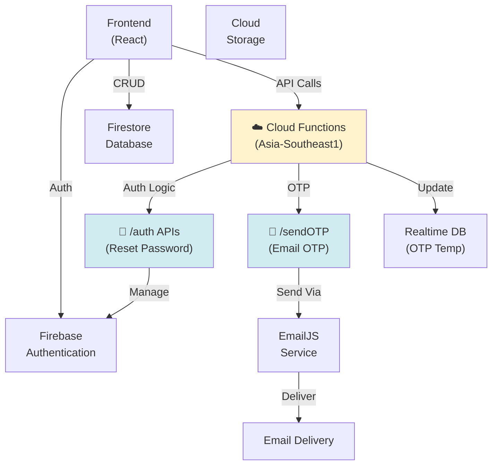
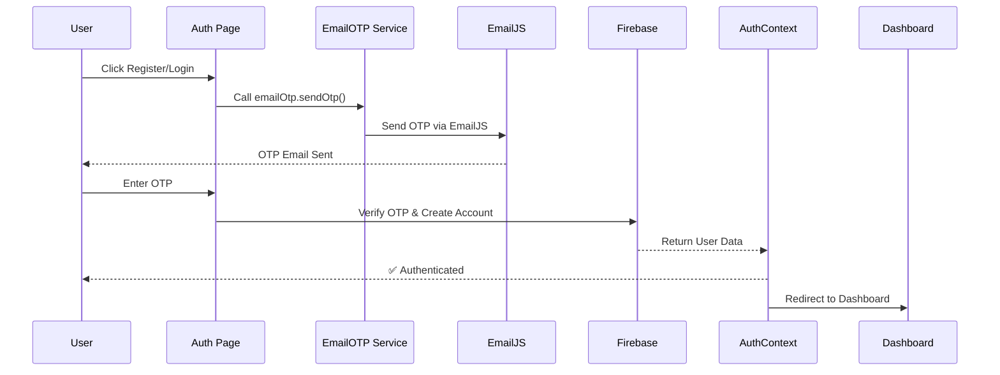
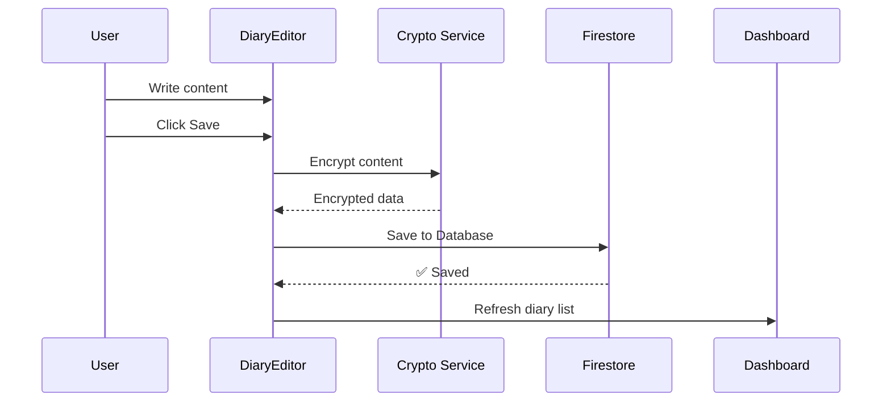
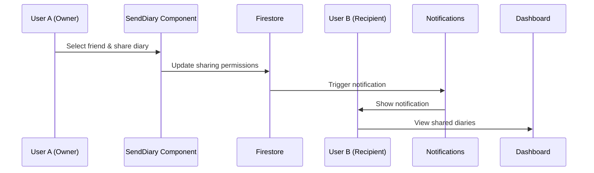
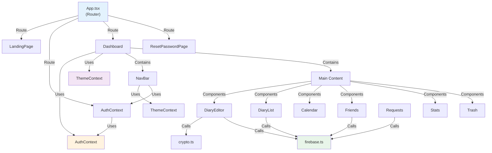

# 🏗️ Sơ Đồ Kiến Trúc - Cozy Crypt Journal

## 📋 Tổng Quan

**Cozy Crypt Journal** là một ứng dụng web diary (nhật ký) hiện đại được xây dựng với React, TypeScript, và Firebase. Ứng dụng cho phép người dùng:
- Đăng ký/Đăng nhập với xác minh OTP qua email
- Tạo, chỉnh sửa, xóa nhật ký cá nhân
- Chia sẻ nhật ký với bạn bè
- Theo dõi trạng thái tâm trạng (mood tracking)
- Quản lý bạn bè
- Hỗ trợ chế độ sáng/tối

---

## 🛠️ Stack Công Nghệ

### Frontend
- **React 18** - UI Framework
- **TypeScript** - Type safety
- **Vite** - Build tool & Dev server
- **Tailwind CSS** - Styling
- **shadcn/ui** - Component library (Radix UI + Tailwind)
- **React Router** - Client-side routing
- **TanStack React Query** - Data fetching & caching
- **React Hook Form** + **Zod** - Form management & validation
- **Sonner** - Toast notifications

### Backend/Services
- **Firebase**
  - Authentication (Email/Password)
  - Firestore Database (NoSQL)
  - Realtime Database (để lưu OTP temp data)
  - Cloud Functions (Express API)
  - Cloud Storage

### Cloud Functions & APIs
- **Express.js** - HTTP API server
- **NodeJS 20** - Runtime
- **Cloud Functions** - Serverless compute

### Build & Development
- **Vitest** - Unit testing
- **ESLint** - Code linting
- **PostCSS** - CSS processing

---

## 📁 Cấu Trúc Thư Mục

```
cozy/
├── src/
│   ├── components/          # Reusable React components
│   │   ├── ConfirmDialog.tsx
│   │   ├── DiaryCalendar.tsx
│   │   ├── DiaryEditor.tsx
│   │   ├── DiaryList.tsx
│   │   ├── FriendRequests.tsx
│   │   ├── FriendsPanel.tsx
│   │   ├── MoodStats.tsx
│   │   ├── MyDiaries.tsx
│   │   ├── NotificationBell.tsx
│   │   ├── SendDiary.tsx
│   │   ├── SettingsPanel.tsx
│   │   ├── SharedDiaries.tsx
│   │   ├── TrashBin.tsx
│   │   └── ui/              # UI Components (shadcn/ui)
│   │
│   ├── contexts/            # React Context Providers
│   │   ├── AuthContext.tsx  # Authentication state & logic
│   │   └── ThemeContext.tsx # Theme management (dark/light)
│   │
│   ├── hooks/               # Custom React hooks
│   │   ├── use-mobile.tsx
│   │   └── use-toast.ts
│   │
│   ├── lib/                 # Utility libraries
│   │   ├── authErrorMessages.ts  # Auth error handling
│   │   ├── crypto.ts             # Encryption/decryption
│   │   ├── emailOtp.ts           # Email OTP service
│   │   ├── firebase.ts           # Firebase initialization
│   │   ├── notifications.ts      # Notification logic
│   │   └── utils.ts              # General utilities
│   │
│   ├── pages/               # Page components (route pages)
│   │   ├── AuthPage.tsx
│   │   ├── Dashboard.tsx
│   │   ├── Index.tsx
│   │   ├── LandingPage.tsx
│   │   ├── NotFound.tsx
│   │   └── ResetPasswordPage.tsx
│   │
│   ├── types/               # TypeScript type definitions
│   │   └── diary.ts
│   │
│   ├── test/                # Unit tests
│   │   ├── example.test.ts
│   │   └── setup.ts
│   │
│   ├── App.tsx              # Main app component with routing
│   ├── main.tsx             # Application entry point
│   ├── i18n.js              # Internationalization config
│   ├── index.css            # Global styles
│   └── App.css              # App specific styles
│
├── functions/               # Firebase Cloud Functions
│   ├── index.js
│   └── package.json
│
├── public/                  # Static assets
│   └── robots.txt
│
├── scripts/                 # Utility scripts
│   └── migrate-email-verified.mjs
│
├── docs/                    # Documentation
│   └── EMAIL_DELIVERABILITY.md
│
├── vite.config.ts          # Vite configuration
├── tailwind.config.ts      # Tailwind CSS configuration
├── tsconfig.json           # TypeScript configuration
├── eslint.config.js        # ESLint configuration
├── postcss.config.js       # PostCSS configuration
├── package.json            # Dependencies & scripts
└── firebase.json           # Firebase configuration
```

---

## 🏛️ Sơ Đồ Kiến Trúc Tổng Quát

```mermaid
graph TB
    subgraph Client["🖥️ Frontend (React + TypeScript)"]
        LandingPage["🏠 Landing Page"]
        AuthPage["🔐 Auth Page<br/>(Login/Register + OTP)"]
        Dashboard["📊 Dashboard"]
        ResetPassword["🔑 Reset Password"]
    end

    subgraph Providers["⚙️ Providers & Contexts"]
        AuthCtx["AuthContext<br/>(User state, Auth logic)"]
        ThemeCtx["ThemeContext<br/>(Dark/Light mode)"]
        QueryClient["React Query<br/>(Data caching)"]
    end

    subgraph Components["🧩 Components Layer"]
        NavBar["NavBar"]
        DiaryEditor["DiaryEditor"]
        DiaryList["DiaryList"]
        Calendar["DiaryCalendar"]
        Friends["FriendsPanel"]
        Requests["FriendRequests"]
        Notifications["NotificationBell"]
        MoodStats["MoodStats"]
        Other["Other Components..."]
    end

    subgraph Utils["🛠️ Utils & Services"]
        Firebase["firebase.ts<br/>(FB Config)"]
        Crypto["crypto.ts<br/>(Encryption)"]
        EmailOTP["emailOtp.ts<br/>(OTP Service)"]
        Notifications["notifications.ts<br/>(Push notifications)"]
        Utils["utils.ts<br/>(Helper functions)"]
        ErrorMessages["authErrorMessages.ts"]
    end

    subgraph Firebase["☁️ Backend (Firebase)"]
        FireAuth["Firebase<br/>Authentication"]
        Firestore["Firestore<br/>Database"]
        CloudFuncs["Cloud<br/>Functions"]
        Storage["Cloud<br/>Storage"]
    end

    subgraph External["🌐 External Services"]
        EmailJS["EmailJS<br/>(Send OTP)"]
    end

    subgraph Types["📝 Type Definitions"]
        DiaryTypes["diary.ts<br/>(Types & Interfaces)"]
    end

    Client -->|"Uses"| Providers
    Providers -->|"Manages"| Components
    Components -->|"Uses"| Utils
    Components -->|"Display"| Utils
    Utils -->|"Calls API"| Firebase
    Utils -->|"Sends email"| EmailJS
    Firebase -->|"Auth"| FireAuth
    Firebase -->|"CRUD"| Firestore
    Firebase -->|"Compute"| CloudFuncs
    Firebase -->|"Store files"| Storage
    Utils -->|"Type check"| Types
    Components -->|"Type check"| Types
    
    style Client fill:#c8e6ff
    style Providers fill:#fff3cd
    style Components fill:#c8e9f0
    style Utils fill:#e8d5ff
    style Firebase fill:#d4edda
    style External fill:#f8d7da
    style Types fill:#e2e3e5
```

---

## ☁️ Backend Architecture (Serverless)

### Tổng Quan
Thay vì xây dựng server riêng, Cozy sử dụng **Firebase** làm backend chính kết hợp với **Cloud Functions + Express** để xử lý logic server-side.

### Các Thành Phần Backend



### Cloud Functions Endpoints

#### 1. **Password Reset OTP**
```
POST /sendPasswordResetOtp
Method: HTTP Cloud Function
Region: asia-southeast1
CORS: Enabled

Request:
{
  "email": "user@example.com",
  "displayName": "User Name"
}

Action:
- Generate 6-digit OTP
- Hash OTP & store in Realtime DB
- Send OTP email via EmailJS
- OTP expires in 10 minutes
```

#### 2. **Password Reset Workflow**
```
POST /auth/reset/request
- Generate reset token
- Store in Realtime DB with 15-min expiry
- Send verification link via email

POST /auth/reset/verify
- Verify reset token
- Return verification status

POST /auth/reset/confirm
- Confirm password change
- Update Firebase Auth
- Mark token as used
```

### Database Storage

#### Realtime Database (Temporary Data)
```
/passwordResetOtps/
├── {emailKey}
│   ├── otp: string (hashed)
│   ├── displayName: string
│   ├── createdAt: timestamp
│   └── expiresAt: timestamp

/passwordResetTokens/
├── {tokenHash}
│   ├── email: string
│   ├── displayName: string
│   ├── createdAt: timestamp
│   ├── expiresAt: timestamp
│   ├── verifiedAt: timestamp | null
│   └── usedAt: timestamp | null
```

#### Firestore (Persistent Data)
```
/users/{userId}
/diaries/{diaryId}
/sharing/{shareId}
/friendRequests/{requestId}
/notifications/{notificationId}
```

### Email Delivery System

#### OTP Email Flow
```
1. User requests OTP
   ↓
2. Cloud Function generates OTP
   ↓
3. Store in Realtime DB (10-min TTL)
   ↓
4. Format email template with OTP
   ↓
5. Send via EmailJS API
   ↓
6. EmailJS delivers via SMTP
   ↓
7. User receives email in inbox
```

#### Configuration (Environment Variables)
```env
# Cloud Functions
EMAILJS_SERVICE_ID=your_service_id
EMAILJS_TEMPLATE_ID=your_otp_template_id
EMAILJS_PASSWORD_RESET_TEMPLATE_ID=your_reset_template_id
EMAILJS_PUBLIC_KEY=your_public_key
APP_NAME=COZY
REGION=asia-southeast1
OTP_EXPIRY_MINUTES=10
PASSWORD_RESET_TOKEN_EXPIRY_MINUTES=15
```

### Security Implementation

#### OTP Security
```javascript
// OTP Generation & Storage
✓ 6-digit random OTP
✓ SHA-256 hashing before storage
✓ Automatic expiry (10 minutes)
✓ Stored in Realtime DB (not Firestore)
✓ Email key encoded in base64url
```

#### Reset Token Security
```javascript
// Token Generation & Validation
✓ 32-byte cryptographic random token
✓ Base64url encoding
✓ SHA-256 hashing before storage
✓ 15-minute expiry
✓ One-time use (mark as usedAt)
✓ Email verification before reset
```

### Cloud Functions Structure

```
functions/
├── index.js
├── package.json
└── Functions:
    ├── sendPasswordResetOtp()
    │   ├── Generate OTP
    │   ├── Hash & store
    │   └── Send email
    │
    ├── POST /auth/reset/request
    │   ├── Validate email
    │   ├── Generate token
    │   └── Send reset email
    │
    ├── POST /auth/reset/verify
    │   ├── Validate token
    │   └── Return status
    │
    └── POST /auth/reset/confirm
        ├── Verify token
        ├── Update password
        └── Mark token used
```

### Deployment

#### Local Development
```bash
# Start Firebase Emulators
firebase emulators:start --only functions

# Test endpoints at localhost:5001
```

#### Production
```bash
# Deploy Cloud Functions
firebase deploy --only functions

# Deployed to Google Cloud Run
# Region: asia-southeast1
```

### Performance Considerations

| Aspect | Implementation |
|--------|---|
| **Cold Start** | ~2-3 seconds (acceptable for auth) |
| **Email Latency** | ~1-5 seconds via EmailJS |
| **OTP Verification** | Instant (Realtime DB lookup) |
| **Scalability** | Auto-scaling via Firebase |
| **Cost** | Pay-per-use (cheap for diary app) |

---

### 1️⃣ Authentication Flow



### 2️⃣ Diary Creation Flow



### 3️⃣ Share Diary Flow



---

## 🔐 Key Components & Responsibilities

### Pages (Route Components)
| Component | Responsibility |
|-----------|-----------------|
| **LandingPage** | Marketing page, introduction |
| **AuthPage** | Login/Register with OTP verification |
| **Dashboard** | Main application, diary management |
| **ResetPasswordPage** | Password recovery workflow |
| **NotFound** | 404 error handling |

### Core Components
| Component | Responsibility |
|-----------|-----------------|
| **NavBar** | Navigation, user menu |
| **DiaryEditor** | Create/edit diary entries |
| **DiaryList** | Display diary entries list |
| **DiaryCalendar** | Calendar view of diaries |
| **FriendsPanel** | Display & manage friends |
| **FriendRequests** | Handle friend requests |
| **NotificationBell** | Display notifications |
| **MoodStats** | Analytics & mood tracking |
| **SendDiary** | Share diary with friends |
| **TrashBin** | Deleted diaries management |

### Context Providers
| Context | State & Logic |
|---------|-------------|
| **AuthContext** | User authentication, login/logout, OTP verification |
| **ThemeContext** | Dark/Light theme management |

### Libraries & Services
| Library | Purpose |
|---------|---------|
| **firebase.ts** | Firebase initialization & config |
| **crypto.ts** | End-to-end encryption/decryption |
| **emailOtp.ts** | Email OTP generation & sending |
| **notifications.ts** | Real-time notifications |
| **utils.ts** | General helper functions |
| **authErrorMessages.ts** | User-friendly error messages |

---

## 🔌 External Integrations

### Firebase Services
- **Authentication**: User login/register
- **Firestore**: Real-time database for diaries, users, sharing
- **Cloud Functions**: Backend logic (notifications, cleanup)
- **Cloud Storage**: Profile pictures, attachments

### EmailJS
- **OTP Delivery**: Send verification codes to email
- Configuration via ENV variables:
  - `VITE_EMAILJS_SERVICE_ID`
  - `VITE_EMAILJS_TEMPLATE_ID`
  - `VITE_EMAILJS_PUBLIC_KEY`

---

## 🗄️ Database Schema (Firestore)

```
firestore/
├── users/
│   ├── {userId}
│   │   ├── email: string
│   │   ├── displayName: string
│   │   ├── photoURL: string
│   │   ├── emailVerified: boolean
│   │   └── createdAt: timestamp
│
├── diaries/
│   ├── {diaryId}
│   │   ├── userId: string (owner)
│   │   ├── title: string
│   │   ├── content: string (encrypted)
│   │   ├── mood: number (1-5)
│   │   ├── isPublic: boolean
│   │   ├── createdAt: timestamp
│   │   ├── updatedAt: timestamp
│   │   └── deletedAt: timestamp | null
│
├── sharing/
│   ├── {shareId}
│   │   ├── diaryId: string
│   │   ├── ownerId: string
│   │   ├── recipientId: string
│   │   ├── permission: string (read|comment)
│   │   └── sharedAt: timestamp
│
├── friendRequests/
│   ├── {requestId}
│   │   ├── fromUserId: string
│   │   ├── toUserId: string
│   │   ├── status: string (pending|accepted|rejected)
│   │   └── createdAt: timestamp
│
└── notifications/
    ├── {notificationId}
    │   ├── userId: string
    │   ├── type: string (friend_request|diary_shared|etc)
    │   ├── message: string
    │   ├── isRead: boolean
    │   └── createdAt: timestamp
```

---

## 🔐 Security Architecture

### Authentication
- ✅ Firebase Authentication (Email/Password)
- ✅ OTP verification via email before account creation
- ✅ Protected routes require authentication
- ✅ Session management via Firebase

### Data Protection
- 🔒 End-to-End Encryption (crypto.ts)
  - Diary content encrypted on client-side
  - Only authenticated users can decrypt
- 🔒 Firestore Security Rules
  - Users can only read/write their own diaries
  - Sharing controlled via sharing collection

### API Security
- 🔒 Firebase Auth tokens
- 🔒 CORS configuration
- 🔒 Rate limiting on Cloud Functions

---

## 🚀 Development Workflow

### Local Development
```bash
# Install dependencies
bun install

# Start dev server
bun run dev

# Run tests
bun test

# Run tests in watch mode
bun test:watch

# Lint code
bun lint

# Build for production
bun build
```

### Environment Setup
Create `.env` file:
```env
VITE_APP_NAME=COZY
VITE_EMAILJS_SERVICE_ID=your_service_id
VITE_EMAILJS_TEMPLATE_ID=your_template_id
VITE_EMAILJS_PUBLIC_KEY=your_public_key
```

---

## 📊 Component Dependencies



---

## 🎯 Key Features & Implementation

| Feature | Components | Services |
|---------|-----------|----------|
| **User Authentication** | AuthPage, ProtectedRoute | AuthContext, emailOtp.ts |
| **Diary CRUD** | DiaryEditor, DiaryList | firebase.ts, crypto.ts |
| **Diary Sharing** | SendDiary | firebase.ts |
| **Friend Management** | FriendsPanel, FriendRequests | firebase.ts, notifications.ts |
| **Mood Tracking** | MoodStats, DiaryEditor | firebase.ts |
| **Notifications** | NotificationBell | notifications.ts, firebase.ts |
| **Theme Management** | SettingsPanel | ThemeContext |
| **Trash/Recycle Bin** | TrashBin | firebase.ts |

---

## 📈 Scalability Considerations

### Current Architecture Supports:
- ✅ Real-time data sync via Firestore
- ✅ Indexed queries for performance
- ✅ Client-side caching with React Query
- ✅ End-to-end encryption

### Future Optimizations:
- 📌 Service Workers for offline support
- 📌 Image optimization & CDN
- 📌 Database sharding for large user base
- 📌 Search indexing (Algolia/Meilisearch)
- 📌 Analytics integration

---

## 🐛 Error Handling

### Authentication Errors
- Handled by `authErrorMessages.ts`
- User-friendly error messages
- Redirect to appropriate page

### Network Errors
- Retry logic in Cloud Functions
- Toast notifications for failures
- Graceful degradation

### Encryption/Decryption Errors
- Try-catch blocks in crypto.ts
- Fallback to read-only mode
- Error logging

---

## 📚 Type System

### Core Types (types/diary.ts)
```typescript
// Contains TypeScript interfaces for:
- User profile
- Diary entry
- Friend relationship
- Sharing permissions
- Notification
- Mood levels
```

---

## 🎨 UI/UX Architecture

### Design System
- **shadcn/ui** + **Radix UI** for accessible components
- **Tailwind CSS** for consistent styling
- **Dark/Light theme** via CSS variables

### Responsive Design
- Mobile-first approach
- Tailwind breakpoints
- `use-mobile.tsx` hook for responsive behavior

---

## 📝 Summary

Cozy Crypt Journal sử dụng kiến trúc **frontend-centric** với:
- **React** cho UI components
- **Firebase** cho backend & data persistence
- **Context API** cho state management
- **End-to-end encryption** để bảo vệ dữ liệu
- **Modular components** để tái sử dụng & maintain

Architecture này đảm bảo:
✅ Security (authentication & encryption)
✅ Scalability (Firebase real-time sync)
✅ Maintainability (component-based, typed)
✅ User Experience (responsive, notifications)
